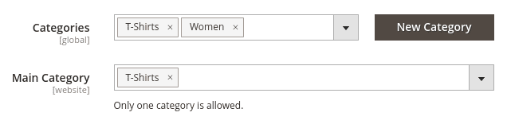

# Magento Product Main Category

[](https://php.net/)
[](https://business.adobe.com/products/magento/magento-commerce.html)
[](https://github.com/Pixel-Open/magento-product-main-category/releases)

## Presentation

The module adds a main category attribute to product.



## Requirements

- Magento >= 2.4.4
- PHP >= 8.0.0

## Installation

```
composer require pixelopen/magento-product-main-category
```

## Retrieve Product Main Category value

```php
$mainCategory = $product->getMainCategory();

// OR

$mainCategory = $product->getData('main_category');

// OR

$mainCategory = $product->getCustomAttribute('main_category')?->getValue();
```
